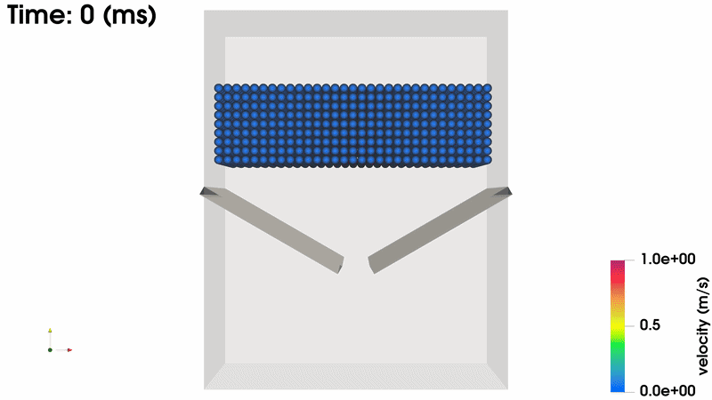

  

# Duy Le, PhD

**Machine Learning & Computational Physics Researcher**  
Melbourne, Australia  

**📧 Email:** [duytrangiale@gmail.com](mailto:duytrangiale@gmail.com)  
**🔗 LinkedIn:** [linkedin.com/in/duytrangiale](https://www.linkedin.com/in/duytrangiale)  
**💻 GitHub:** [github.com/duytrangiale](https://github.com/duytrangiale)
**📚 Google Scholar:** [scholar.google.com](https://scholar.google.com.au/citations?user=HEg9VbAAAAAJ)

---

## About

I am a research engineer with a PhD in **computational physics and deep learning**, working at the intersection of:

- physics-based simulation  
- scientific computing  
- neural network surrogate models  

My recent work focuses on developing **deep-learning surrogates** for **granular flow simulations**, replacing expensive Discrete Element Method (DEM) solvers with fast, data-driven models while preserving physical fidelity.

I am particularly interested in research and engineering roles involving **ML for physical systems**, **AI for engineering applications**, and **scientific computing**.

---

## Research Interests

- Machine learning for physical and engineering systems  
- Surrogate modelling for numerical simulations  
- Discrete Element Method (DEM) and granular materials  
- Scientific computing and high-performance computing (HPC)  
- 3D geometry and dynamics systems
- Physics-informed machine learning and data-driven modelling

---

## Highlights

- 🎓 **PhD in Computational Physics & Deep Learning**  
  Federation University, Australia – Thesis: Accelerated Surrogate Modelling of Granular Materials using Artificial Neural Networks.

- 🧠 Developed deep-learning surrogates achieving **70–120× speedups** over DEM simulations while maintaining physically meaningful behaviour.

- 💻 Built large-scale **data pipelines** and **training frameworks** for 3D particle simulations, using Python, PyTorch, NumPy/Pandas, and Slurm-based HPC workflows.

- 📄 First author of peer-reviewed publications in **machine learning**, **computer vision**, **robotics**, and **granular materials**.

---

## Selected Projects

### 1. Neural Surrogate for 3D Granular Flow

**Keywords:** Deep learning, discrete element method, surrogate modelling, scientific ML  

- Developed a **deep neural surrogate model** to approximate 3D granular flow dynamics in industrial systems (e.g., hoppers, rotating drums, mixers), replacing computationally expensive Discrete Element Method (DEM) simulations.  
- Designed **3D continuous convolutional architectures** to model particle–particle and particle–boundary interactions directly from spatial data, enabling accurate learning of complex contact dynamics.  
- Achieved **70–120× speedup** over high-fidelity DEM while preserving key physical behaviours, including **mixing dynamics, energy evolution, and collision-driven interactions**.  
- Built an **end-to-end ML pipeline**: large-scale DEM data generation, preprocessing of particle states, distributed training on HPC (Slurm), and physics-based evaluation metrics for validation.  
- Validated the model against DEM baselines using **physically meaningful metrics** (e.g., kinetic energy, mixing entropy, collision statistics), demonstrating strong generalisation across operating conditions.

**Publications:**  
- “A Neural Network Surrogate for Modelling Granular Flow Dynamics in Industrial Applications with Dynamic Boundary Conditions”, *Powder Technology*, 2026.
- “Machine Learning Accelerated Prediction of 3D Granular Flows in Hoppers”, *The 33rd International Conference on Artificial Neural Networks*, 2024.

  
  
   
  <em>Neural surrogate prediction of 3D granular flows in industrial machines</em>

---

### 2. DEM Data Tools & Physical Metrics

**Keywords:** Scientific computing, data analysis, physical validation  

- Developed Python utilities to process DEM simulation outputs into ML-ready datasets.  
- Implemented computation of physically relevant metrics:
  - mixing entropy and composition profiles  
  - translational and rotational kinetic energy  
  - angular velocity fields and alignment measures  
  - collision-based metrics such as coefficients of restitution  
- Used these tools to benchmark neural network surrogates against high-fidelity DEM baselines.

---

### 3. Low-Cost Pseudo-LiDAR for 3D Object Detection

**Keywords:** Computer vision, 3D perception, pseudo-LiDAR, autonomous driving  

- Proposed a **low-cost pseudo-LiDAR pipeline** that reconstructs 3D structure from monocular imagery by integrating **SLIC-based superpixel segmentation** with depth estimation, enabling structured and efficient point cloud generation.  
- Designed a **region-aware depth refinement strategy**, leveraging superpixels to enforce spatial consistency and reduce noise in reconstructed 3D geometry.  
- Converted image-derived depth maps into **LiDAR-like point cloud representations**, allowing the use of standard 3D detection pipelines while avoiding expensive LiDAR sensors.  
- Evaluated the approach on **3D object detection tasks**, demonstrating competitive performance for camera-based perception and highlighting the feasibility of **cost-efficient alternatives to LiDAR systems**, which are typically expensive despite their accuracy.  
- Showed that improved **data representation (pseudo-LiDAR format)** significantly enhances detection performance compared to conventional image-based methods, aligning with findings that representation plays a key role in bridging the gap with LiDAR-based systems.

**Publication:**  
“Simple linear iterative clustering based low-cost pseudo-LiDAR for 3D object detection in autonomous driving”, *Multimedia Tools and Applications*, 2023.

   
  <em>3D object detection based on the pseudo-LiDAR</em>

---

### 4. Haptic Hand Exoskeleton for Virtual Reality Applications

**Keywords:** Robotics, haptics, mechatronics, human-machine interaction

- Designed and implemented a **force-controllable hand exoskeleton** capable of delivering direct fingertip force feedback while preserving natural finger motion.
- Developed a **bio-inspired linkage mechanism** based on human finger kinematics, enabling accurate force transmission and ergonomic interaction.
- Integrated a **series elastic actuator (SEA) system** (linear motor, spring, and sensing) to achieve stable, controllable, and compliant force feedback.
- Analysed and optimised the force transmission characteristics to ensure effective feedback at the fingertips during interaction with virtual objects.
- Demonstrated the system’s ability to provide **realistic haptic sensations** in VR environments, improving immersion while maintaining a **lightweight and low-cost design**.

**Publications:**  
- “An Efficient Force-Feedback Hand Exoskeleton for Haptic Applications”, *International Journal of Intelligent Robotics and Applications*, 2021.  
- “A Design of Haptic Hand Exoskeleton for Virtual Reality Applications”, *ASYU 2021 (IEEE)*.

   
  <em>Force-feedback hand exoskeleton for virtual reality applications</em>

---

### 5. Automating the Archaeological Toolkit: Mechatronic microdrill sampling of inclusions within pottery sherds

**Keywords:** Systems engineering, mechatronics design, project delivery, real-world problem solving  

- Developed a **complete engineering solution to a real-world problem**, progressing from problem definition through to final validated prototype within a multidisciplinary team environment.  
- Translated stakeholder needs into **quantifiable engineering requirements**, including performance targets, operational constraints, and evaluation metrics.  
- Performed **concept generation and trade-off analysis**, comparing multiple design approaches based on feasibility, cost, performance, and implementation complexity.  
- Designed and implemented a **functional prototype**, integrating mechanical, computational, and/or data-driven components depending on system requirements.  
- Conducted **testing and validation against defined metrics**, analysing system performance and identifying limitations under realistic operating conditions.  
- Applied **iterative design and refinement**, improving system performance based on experimental results and engineering analysis.  
- Delivered detailed **technical documentation and presentations**, communicating design decisions, assumptions, and outcomes to both technical and non-technical stakeholders.

   
  <em>Demonstration of the automatic archaeological toolkit</em>

---

## Selected Publications 

Below are a few representative works:

- [**A Neural Network Surrogate for Modelling Granular Flow Dynamics in Industrial Applications with Dynamic Boundary Conditions**](https://doi.org/10.1016/j.powtec.2026.122258)  
  ***Duy Le**, Gary W. Delaney, Linh Nguyen, Truong Phung, David Howard, Gayan Kahandawa, Manzur Murshed*  
  *Powder Technology*, 2026.

- [**Machine Learning Accelerated Prediction of 3D Granular Flows in Hoppers**](https://link.springer.com/chapter/10.1007/978-3-031-72356-8_22)  
  ***Duy Le**, Linh Nguyen, Truong Phung, David Howard, Gayan Kahandawa, Manzur Murshed, Gary W. Delaney*  
  *33rd International Conference on Artificial Neural Networks (ICANN)*, 2024.

- [**Simple linear iterative clustering based low-cost pseudo-LiDAR for 3D object detection in autonomous driving**](https://link.springer.com/article/10.1007/s11042-023-14439-5)  
  ***Duy Le** and Linh Nguyen*  
  *Multimedia Tools and Applications*, 2023.

- [**An Efficient Force-Feedback Hand Exoskeleton for Haptic Applications**](https://link.springer.com/article/10.1007/s41315-021-00197-w)  
  ***Duy Le** and Linh Nguyen*  
  *International Journal of Intelligent Robotics and Applications*, 2021.

- [**An Efficient Multi-Vehicle Routing Strategy for Goods Delivery Services**](https://ieeexplore.ieee.org/stamp/stamp.jsp?arnumber=9541547)  
  ***Duy Le**, Ying Men, Yunkang Luo, Yixuan Zhou, Linh Nguyen*  
  *IEEE International Conference on Advanced Robotics and its Social Impacts*, 2021.

---

## Skills Overview

**Languages:** Python, C, MATLAB, Java  
**ML/AI:** PyTorch, TensorFlow, Scikit-learn, Open3D, Kubernetes, RAG, LLM
**Data & Scientific Computing:** NumPy, Pandas, SciPy, data pipelines  
**Simulation & Modelling:** Discrete Element Method (DEM), numerical methods, optimisation  
**Tools:** Git, Slurm, Linux, HPC clusters  
**Visualisation:** Matplotlib, seaborn, ParaView  
**Other:** CUDA (basic), LaTeX, scientific writing  

---

## CV & Contact

- **📄 CV / Résumé:** [Download PDF](DuyLe-Resume-github.pdf)
- **📧 Email:** [duytrangiale@gmail.com](mailto:duytrangiale@gmail.com)  
- **🔗 LinkedIn:** [linkedin.com/in/duytrangiale](https://www.linkedin.com/in/duytrangiale)  
- **💻 GitHub:** [github.com/duytrangiale](https://github.com/duytrangiale)
- **📚 Google Scholar:** [scholar.google.com](https://scholar.google.com.au/citations?user=HEg9VbAAAAAJ)

Please feel free to reach out regarding opportunities in machine learning, scientific computing, and research engineering.
